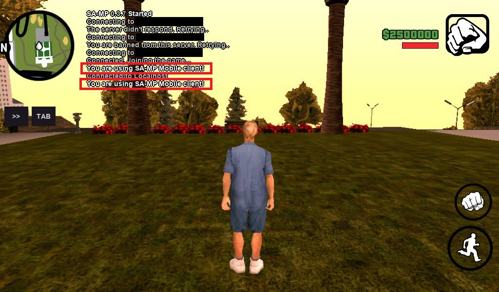

# SAMP-Mobile-Checker
This includes detects players who are connected to the server with the [SA-MP Mobile](https://play.google.com/store/apps/details?id=ru.unisamp_mobile.launcher)
<a href="https://play.google.com/store/apps/details?id=ru.unisamp_mobile.launcher"></a> client

## Installation
Simply install to your project:

```bash
sampctl install adib-yg/samp-mobile-checker
```
Include in your code and begin using the include:

```pawn
#include <mobile-checker>
```

## How Does It Work
The CI serial of SA-MP Mobile players is always the same.

So we just check with `strcmp` the CI serial of player is the same or not.

## Use
```pawn
#include <mobile-checker>

public OnPlayerConnectViaSampMobile(playerid) 
{
    SendClientMessage(playerid, -1, "You are using SA-MP Mobile client!");
}

public OnPlayerSpawn(playerid) 
{
    if(IsPlayerUsingSampMobile(playerid)) 
    {
        SendClientMessage(playerid, -1, "You are using SA-MP Mobile client!");
    }
}
```



## Functions
```pawn
bool: IsPlayerUsingSampMobile(playerid); // Also works in OnPlayerConnect() callback
```

## Callbacks
```pawn
forward OnPlayerConnectViaSampMobile(playerid);
```
